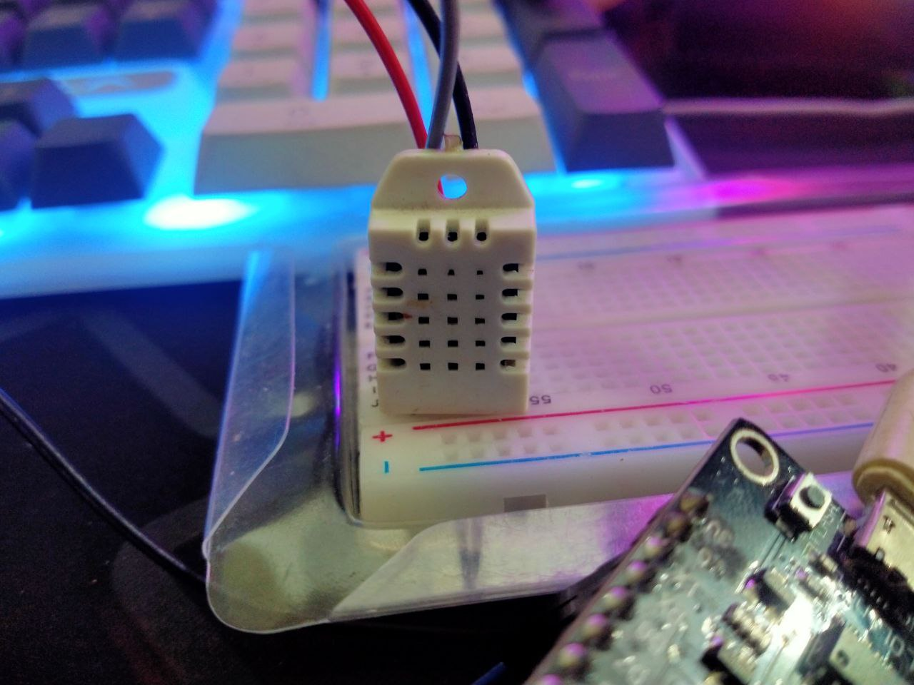
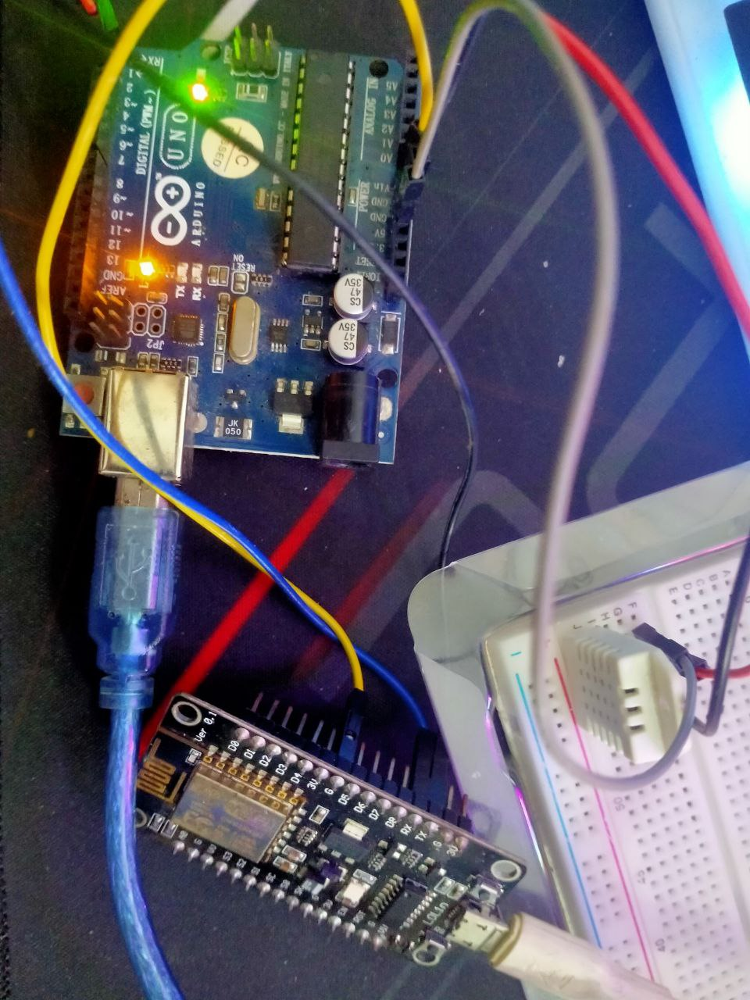

# Arduino Uno → ESP8266 Serial Communication using DHT22

This project demonstrates a safe and reliable method to read temperature and humidity data from a **DHT22 sensor**
using **Arduino Uno** and transmit the data to an **ESP8266 (NodeMCU / Wemos D1 Mini)** via serial communication.

---

## Project Overview

- Arduino Uno reads temperature & humidity from DHT22
- Data is sent via Serial (TX/RX)
- ESP8266 receives, parses, and displays the data
- Logic-level mismatch is handled using a voltage divider

---

## Hardware Components

- Arduino Uno
- ESP8266 (NodeMCU / Wemos D1 Mini)
- DHT22 Temperature & Humidity Sensor (4-pin)
- 10kΩ Pull-up Resistor (DHT22 DATA)
- Voltage Divider (1.8kΩ + 3.3kΩ)
- Breadboard & Jumper Wires

---

## Pin Connections

### DHT22 → Arduino Uno

| DHT22 Pin | Arduino Uno   |
| --------- | ------------- |
| VCC       | 5V            |
| DATA      | D2            |
| GND       | GND           |
| NC        | Not Connected |

10kΩ pull-up resistor between DATA and VCC

---

### Arduino Uno → ESP8266 (Serial)

| Arduino Uno | ESP8266                        |
| ----------- | ------------------------------ |
| TX (D1)     | RX (GPIO3) via voltage divider |
| RX (D0)     | TX (GPIO1)                     |
| GND         | GND                            |

ESP8266 uses **3.3V logic** — voltage divider is mandatory.

---

## Required Libraries

### Arduino Uno

- DHT sensor library (Adafruit)
- Adafruit Unified Sensor

Install from:
**Arduino IDE → Sketch → Include Library → Manage Libraries**

---

## Project Images

### Hardware Setup

### Serial Output

---

## Tested Environment

- Arduino IDE 2.x
- Baud Rate: 9600
- Board: Arduino Uno & Wemos D1 Mini

---

## Author

Shahriar Alom Masud
B.Sc. Engg. in IoT & Robotics Engineering
University of Frontier Technology, Bangladesh
📧 Email: shahriar0002@std.uftb.ac.bd
🔗 LinkedIn: https://www.linkedin.com/in/shahriar-alom-masud

---
